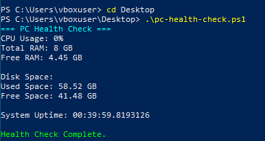

# PC Health Checker

## Overview
This project is a beginner PowerShell-based IT support tool that performs basic Windows system diagnostics.

## Features
- CPU usage monitoring
- RAM usage monitoring
- Disk space checks
- System uptime reporting
- Warning alerts for high resource usage

## Technologies Used
- PowerShell
- Windows 10 VM
- VirtualBox

## Purpose
This project was built to practice:
- IT troubleshooting
- Windows administration
- PowerShell scripting
- basic automation

## How to Run
Open PowerShell and run:

```powershell
.\pc-health-check.ps1
```

## Author
Parthiv Patel

## Output Screenshot


